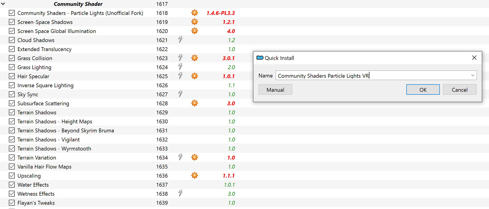
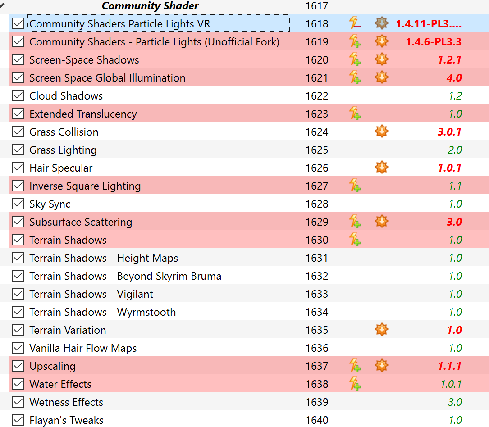
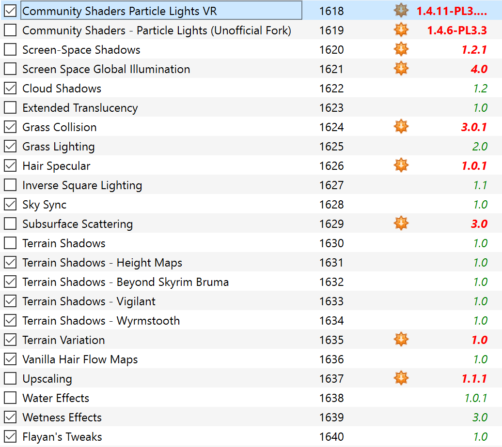
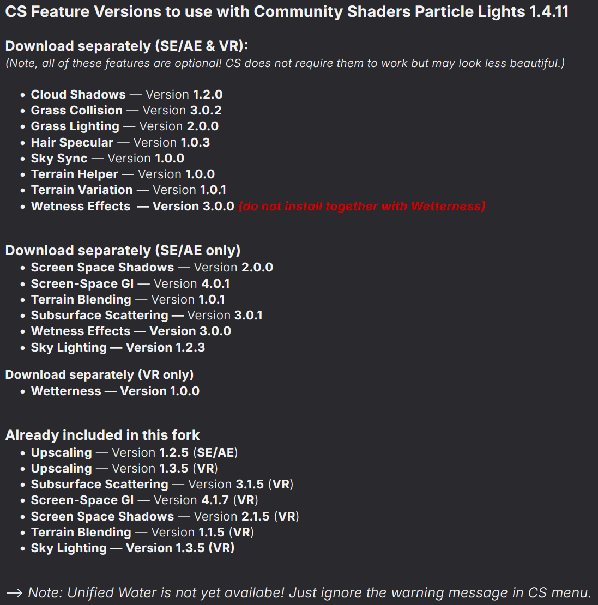
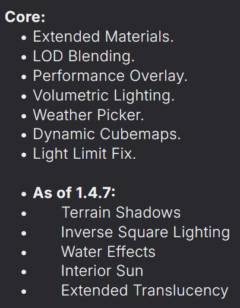
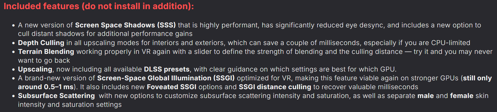
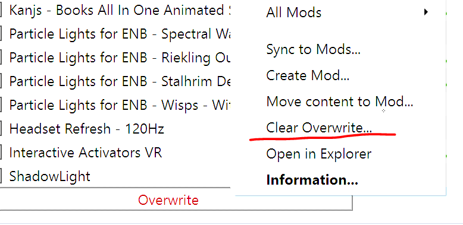
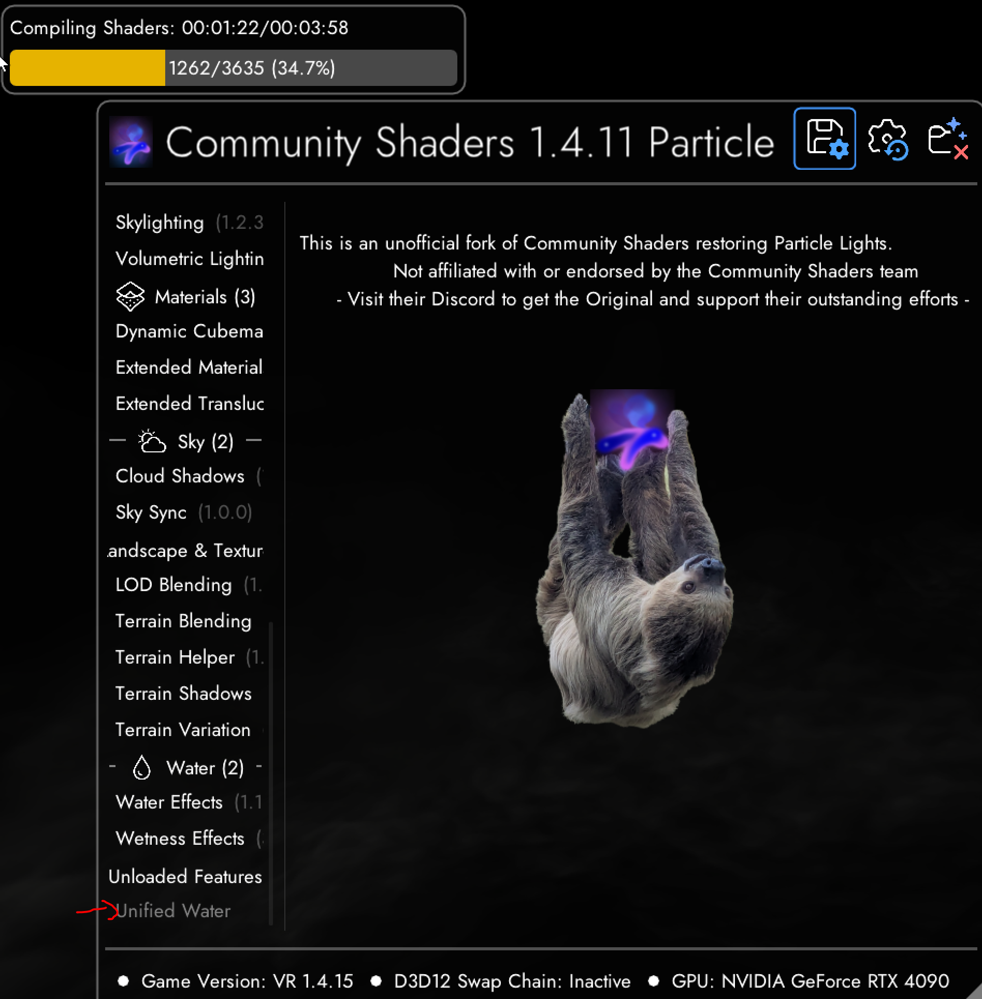
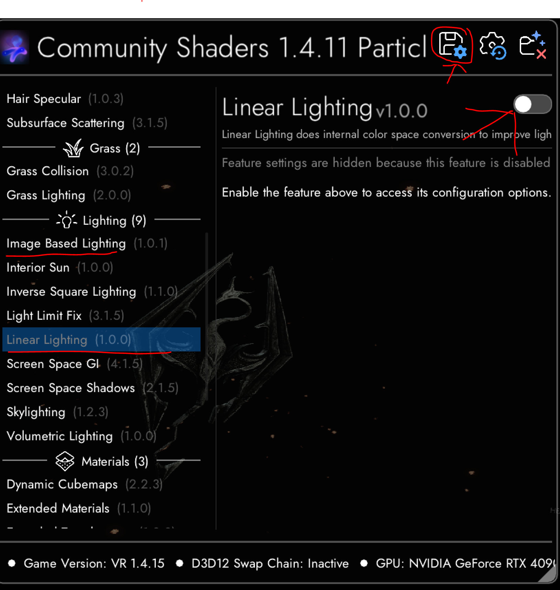
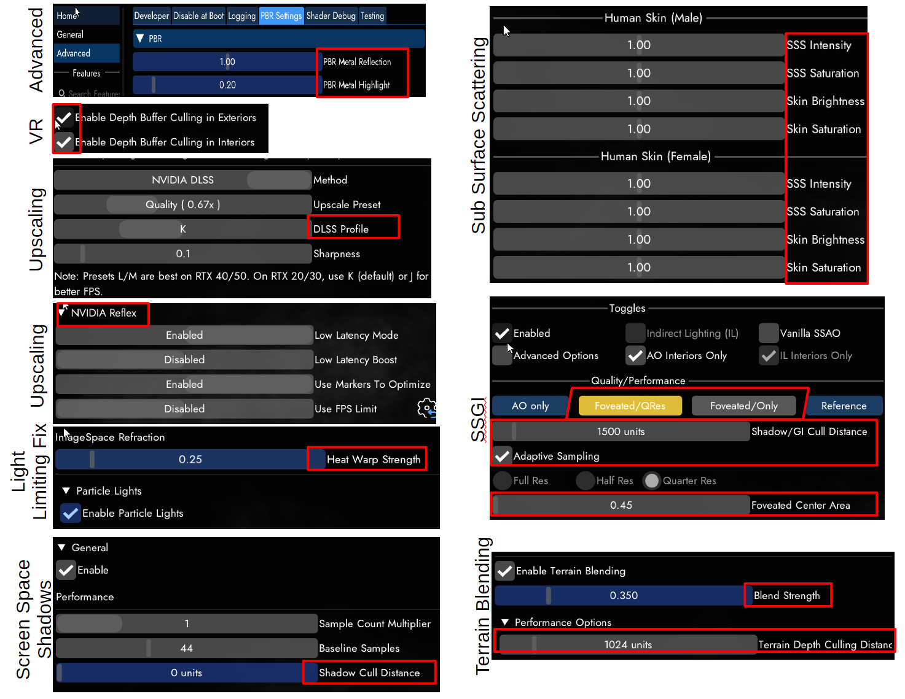

# Installation Guide  
## Community Shaders - Particle Lights Fork and Wetterness

---

## 1. Download the latest VR version

Download the latest version of **Community Shaders - Particle Lights Fork** for from Nexus:

**Community Shaders - Particle Lights (Unofficial Fork)**  
https://www.nexusmods.com/skyrimspecialedition/mods/166950

For VR, use the file with the appendix -VR, for SE/AE with the extension -SE. Note, both versions are compatible with either setup.

Please also read the full mod description and the sticky post in the comments section, as these usually contain the most up-to-date information, known issues, and version-specific notes:

https://www.nexusmods.com/skyrimspecialedition/mods/166950?tab=posts

---

## 2. Install in your modlist via MO2

Install the downloaded **.7z** file with **Mod Organizer 2**.

In your MO2 left pane, move the newly installed file directly **above** your existing **Community Shaders Unofficial Fork** mod in the Community Shaders section of MGO.



---

## 3. Check which old files are now overwritten

Click on the newly installed **Community Shaders Particle Lights VR** file in MO2.

You will now see that several Community Shaders feature mods below it turn **red**. This means these files are being overwritten by the new fork/core package.



---

## 4. Disable old overwritten features

Untick all red Community Shaders feature mods that are now overwritten.

Also untick the old **Community Shaders Unofficial Fork** file.



> **Important:** Do not keep old overwritten feature files active below the new fork. Otherwise, they can overwrite newer files and cause shader compile errors, missing features, or unexpected graphical issues.

---

## 5. Update remaining active CS features

Now update all remaining Community Shaders features that are still checked/active from Nexus.



Not every feature shown in your MGO/modlist setup is required. Community Shaders is modular, so many features are optional. The game will work without them, but most of them improve visuals.

### Note about Unified Water

**Unified Water** may appear as unloaded. This is currently only a placeholder for an upcoming feature. Once it is available on Nexus, you can install it like any other Community Shaders feature and it will load normally.

---

## 6. Why many old features now turn red

Community Shaders used to provide many features as separate downloads. This was useful because it gave individual features more visibility and acknowledged the work of different contributors.

However, separate feature plugins can also make development and compatibility more difficult. Because of this, the Community Shaders team has moved several features back into the main Community Shaders core file.

This is why, compared to older CS 1.4.6-based setups, features such as **Inverse Square Lighting** and several others may now turn red in MO2 when you select the main file.

That usually means:

```text
The feature is already included in the main Community Shaders file.
The old separate feature below it would overwrite the newer core files.
You do not want this.
```

Disable these old separate files if they are already included in the new core package.



---

## 7. Additional VR-core features in the Particle Lights Fork

Because the **Community Shaders Particle Lights VR Fork** includes additional VR-specific optimisations, several features are now also included as core features in the VR fork.

This means you no longer need to download and install these separately.



In future updates, more features may be moved into the core package, so the number of extra feature downloads needed will likely be reduced further.


---

## 8. Update SKSE VR Address Library

Update **SKSE VR Address Library**:

https://www.nexusmods.com/skyrimspecialedition/mods/58101

This is required for many SKSE/CommonLib-based plugins to work correctly.

---

## 9. Possible startup errors: Light Placer / Address Library

When starting Skyrim VR through MO2, you may see an error message.

> Insert screenshot of error message here.

This usually means one of the following:

- You forgot to update **SKSE VR Address Library**.
- You also need to update **Light Placer**.
- You also need to update **Light Placer VR**.

Update these two mods if needed:

**Light Placer**  
https://www.nexusmods.com/skyrimspecialedition/mods/127557

**Light Placer VR**  
https://www.nexusmods.com/skyrimspecialedition/mods/135822

> **Important:** **Light Placer** and **Light Placer VR** must have the same version number.

Example:

```text
Light Placer 4.2.0
Light Placer VR 4.2.0
```

These updates should be safe to make during an existing playthrough. Only update them if you get the error message or if the new fork specifically requires it.

---

## 10. Clear shader cache / Overwrite

Before starting the game, clear the shader cache from MO2.

Go to the **Overwrite** folder at the bottom of MO2.



You can either press **Clear Overwrite** and delete the contents, or, more safely:

1. Right-click **Overwrite**.
2. Choose **Open in Explorer**.
3. Delete only the **ShaderCache** folder manually.

> **Recommended:** If you use mods that store configuration files in Overwrite, it is safer to open the folder manually and delete only the shader cache.

Deleting the shader cache is 100% sufficient for a new Community Shaders install.

If you accidentally clear the whole Overwrite folder, do not panic. The shader cache folder is regenerated when Skyrim VR starts.

Modlist  often integrate their CS user configuration file (SettingsUser.json) as a "mod". In that case your Community Shaders configuration file is saved in that dedicated MO2 mods instead of only in Overwrite.

> Insert screenshot of CS configuration mod location here.

The important point is:

```text
Your CS settings are saved in these MO2 configuration mods.
Deleting Overwrite does not normally remove your saved CS settings in MGO.
You do not have to do anything special here.
```

---

## 11. Start Skyrim VR and let shaders compile

Start **Skyrim VR** through MO2.


> **Very important:** When the game starts, Community Shaders will compile shaders.

You must let this finish completely before starting your game.

Do not load into the game too early. If you do, you may see graphical artefacts, broken effects, or shader failures.

Depending on your CPU, shader compilation can take around:

```text
4-10+ minutes
```

Just be patient and let it finish.

---

## 12. Open the Community Shaders menu

While waiting, you can press the **END** key to open the Community Shaders menu.



At the bottom of the menu, you may see **Unified Water** listed in grey as an unloaded mod. You may also see a red warning elsewhere in the UI.

This is normal.

Unified Water is already indexed by Community Shaders, but the actual feature does not yet exist as a released mod. This warning does not affect any functional feature.

You can now customise Community Shaders according to your own performance and graphical preferences.

My recommendations below are based on my own system:

```text
Ryzen 9800X3D
RTX 4090
```

If your system is weaker, you may need to reduce some settings.

You can press **END** at any time in-game to open or close the CS menu. Many changes can be previewed in real time.

> **Reminder:** Only start playing once all shaders have compiled.

---

# Recommended features

These are my favourite additional features and their approximate performance cost on my system.

## Terrain Blending

**Absolute must-have.**

Approximate cost:

```text
~0.3 ms
```

Terrain Blending makes objects blend much more naturally into the ground and removes many harsh object/terrain intersections.

## Screen Space Shadows

**Absolute must-have.**

Approximate cost:

```text
~0.4 ms
```

There can be small graphical issues in VR, such as slight movement of screen-space shadows when looking strongly downward at your feet, or minor distant shadow movement. These can be reduced by distance culling.

## Wetterness

Approximate cost is heavy dependent on rain and thunder intensity. - none if dry (Unlike Wettness Effects):

```text
~0.5-1.5 ms
```


Wetterness makes rain, puddles, and wet surfaces feel much more natural. In heavy rain, it can feel much closer to standing outside in a real thunderstorm.

## SSGI / Ambient Occlusion

Approximate cost:

```text
~0.5-0.8 ms
```

SSGI adds a lot of depth, especially in interiors, but it has a higher performance cost. Use the foveated modes if needed.

You are usually less FPS-limited inside interiors, so using SSGI indoors only is a good compromise.

---

# Features you could disable if you need more performance

If you can afford the performance cost, you can leave most features enabled.

Personally, I would disable to save cost if that is needed:

- **Skylighting** — can cost more than 1 ms.
- **Cloud Shadows** — Skyrim VR already has many incorrect shadows, and this can cost around 0.3 ms.

## Image Based Lighting / Linear Lighting

**Image Based Lighting** is not fully ready for general use yet.

**Linear Lighting** is intended for upcoming post-processing presets that are not yet available.

Both are currently core features, but I usually disable them for now.

To unload a feature:

1. Open the CS menu.
2. Toggle the upper-right button off for the feature.
3. Save.
4. Exit and restart the game.

You only need to do this once, because the setting is saved in your CS configuration.



---

# Complex Material / ice mesh wobble issue

If you see ice meshes wobbling, especially ice cliffs behind Winterhold changing colour from bright to dark while you move toward them, disable:

```text
Enable Complex Material
```

This was needed in MGO 3.66. I am not sure if it is still required in MGO 3.88.


---

# Most important settings



## VR settings

In the VR section, keep both VR depth culling o-ptions enabled.


## Upscaling

My preferred settings are:

```text
DLAA + Profile K
or
Quality Upscaling + Profile K

Sharpness: 0.1
```

Read the tooltips in the CS menu by hovering your mouse over each setting. They explain which options are best for different GPUs and performance targets.


---

# NVIDIA Reflex

 **NVIDIA Reflex**.

Reflex synchronises CPU and GPU timing to reduce stutter and helps keep the GPU close to full utilisation. This is especially useful in Skyrim VR, where CPU spikes can easily cause visible stutters.

Example test image:


For me, Reflex removes many stutters when:

- quickly turning around,
- new LODs pop in,
- many NPCs are nearby,
- the CPU briefly spikes.

With Reflex, the brown CPU-spike lines in my test are gone or strongly reduced, CPU load stays more stable, and the GPU runs close to 100% more consistently.

This may cost a few average FPS, but the game can feel much smoother, even on a 4090 + 9800X3D system.

> **Low Latency Boost warning:** Use **Low Latency Boost** at your own risk.

This can make your GPU draw more power and run hotter. You need a well-cooled system for this.

For 99% of users, the default Reflex settings shown in the screenshot should be fine.

Again: read the tooltips.

---

# Terrain Blending settings

Use the **Blend Strength** slider to adjust how strong the terrain blending effect is.

Use the culling slider to save performance.

My settings:

```text
Culling slider: 1024
```

For a little extra FPS, you can use:

```text
Culling slider: 512
```


---

# Screen Space Shadows settings

I usually set the culling slider to around:

```text
10000
```

This helps reduce far-distance shadow artefacts and saves a little performance.


---

# SSGI settings

SSGI adds many new contact shadows and improves depth perception in VR.

If you have a strong GPU, try:

```text
AO mode
Interiors only
```

This can cost around:

```text
+1 ms
```

If you need more performance, use one of the foveated modes.

Approximate comparison:

```text
AO only:
Best full-screen quality, highest cost.

Foveated / QRes:
Around 0.5 ms lighter than AO only.

Foveated only:
Similar to AO only, but limited to a smaller central window in the HMD.
```

For the foveated window size, try values around:

```text
0.5-0.7
```

For smaller windows and lower cost, try:

```text
0.3-0.5
```

This can save around:

```text
0.1-0.3 ms
```

Adjust this to your own headset, GPU, and comfort level.

--> NOTE: if you use Foveated Upscaling (DLSS FOV) the moask you set there will be used for SSGI as well

---

# Final notes

After installation:

- Make sure old overwritten CS feature mods are disabled.
- Make sure SKSE VR Address Library is updated.
- Update Light Placer and Light Placer VR only if required.
- Clear the shader cache.
- Start Skyrim VR through MO2.
- Let shader compilation finish fully before loading into the game.
- Press **END** to adjust Community Shaders settings in-game.

Once everything is compiled and configured, you are ready to play.

Enjoy Skyrim VR with Particle Lights, VR-specific optimisations, and the updated Community Shaders feature setup.
